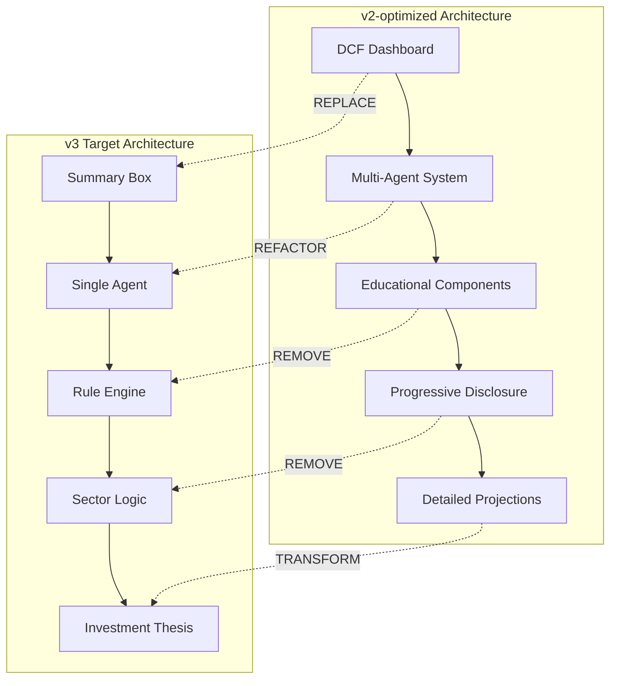

# EquityScope Architecture Migration Strategy: v2-optimized → v3
*Detailed migration plan with versioning, breaking changes, and implementation strategy*

## 📋 **Executive Summary**

### **Migration Scope**
This document outlines the complete architectural transformation from EquityScope v2-optimized (educational DCF platform) to EquityScope v3 (executive summary engine). This is a **major breaking change** requiring complete frontend redesign and backend restructuring.

### **Migration Complexity: HIGH**
- **Frontend**: 70% component rewrite required
- **Backend**: 50% API redesign with new endpoints
- **Database**: New schema for summary data and caching
- **User Experience**: Complete UX paradigm shift

### **Timeline Impact**
- **Development**: 6 weeks for complete transition
- **Testing**: 2 weeks for comprehensive QA
- **Documentation**: 1 week for complete docs rewrite
- **Total**: **9 weeks for production-ready v3**

## 🏗️ **Architectural Comparison: v2 vs v3**

### **Core Philosophy Shift**

| Aspect | v2-optimized | v3 Target | Migration Complexity |
|--------|--------------|-----------|---------------------|
| **Primary Goal** | Teach DCF methodology | Provide investment insights | HIGH - Complete UX redesign |
| **User Journey** | Learn → Practice → Master | Search → Analyze → Decide | HIGH - New user flows |
| **Data Presentation** | Detailed projections | Executive summary | MEDIUM - New components |
| **AI Usage** | Multi-agent education | Single-agent analysis | HIGH - Agent architecture |
| **Mobile Priority** | Secondary | Primary | MEDIUM - Responsive redesign |

### **Component Architecture Changes**



## 🔄 **Detailed Migration Plan**

### **Phase 1: Backend API Restructuring (Week 1-2)**

#### **1.1 New API Endpoints**

##### **CREATE: Summary Engine Endpoints**
```python
# NEW v3 endpoints
@router.get("/api/v3/summary/{ticker}/simple")
async def get_simple_summary(ticker: str) -> SimpleSummaryResponse:
    """Rule-based executive summary with templated insights"""
    
@router.get("/api/v3/summary/{ticker}/agentic") 
async def get_agentic_summary(ticker: str) -> AgenticSummaryResponse:
    """LLM-generated investment thesis with sector context"""

@router.get("/api/v3/peers/{ticker}")
async def get_peer_analysis(ticker: str) -> PeerComparisonResponse:
    """Auto-selected peer comparison with sector context"""
```

##### **MODIFY: Existing DCF Endpoints**
```python
# MODIFIED - Keep for backward compatibility but mark deprecated
@router.post("/api/v2/multi-stage-dcf")
@deprecated("Use /api/v3/summary/{ticker}/simple instead")
async def calculate_multi_stage_dcf(...):
    """DEPRECATED: Legacy DCF endpoint"""
```

##### **REMOVE: Educational Endpoints**
```python
# REMOVE - No longer needed in v3
- /api/v2/educational-content
- /api/v2/progressive-disclosure  
- /api/v2/demo-analyses (unless repurposed for v3 summaries)
```

#### **1.2 Data Models Restructuring**

##### **NEW: Summary Response Models**
```python
class FairValueBand(BaseModel):
    min_value: float
    max_value: float
    current_price: float
    method: str  # "DCF", "PE_Multiple", "Sector_Average"
    confidence: float  # 0.0 to 1.0

class InvestmentLabel(str, Enum):
    STRONGLY_BULLISH = "Strongly Bullish"
    CAUTIOUSLY_BULLISH = "Cautiously Bullish" 
    NEUTRAL = "Neutral"
    CAUTIOUSLY_BEARISH = "Cautiously Bearish"
    STRONGLY_BEARISH = "Strongly Bearish"

class SummaryResponse(BaseModel):
    ticker: str
    company_name: str
    fair_value_band: FairValueBand
    investment_label: InvestmentLabel
    key_factors: List[str]
    
    # Three lens analysis
    valuation_insights: str
    market_signals: str  
    business_fundamentals: str
    
    # Metadata
    data_health_warnings: List[str]
    analysis_timestamp: datetime
    analysis_mode: str  # "simple" or "agentic"
    sector: str
```

##### **MODIFIED: Existing Models**
```python
# Keep DCF models for internal calculations but not primary output
class DCFProjection(BaseModel):  # INTERNAL USE ONLY
    # Existing fields remain for calculations
    # But not exposed in v3 API responses
```

#### **1.3 Agent Architecture Migration**

##### **REPLACE: Multi-Agent System**
```python
# REMOVE: v2 multi-agent architecture
class AnalysisEngine:  # DELETE
class DCFValidator:    # DELETE
class AgenticCoordinator:  # DELETE

# CREATE: Single agent system
class FinancialAnalystAgent:
    def __init__(self):
        self.prompt_template = self._load_sector_aware_prompts()
        self.fallback_handler = GracefulDegradationHandler()
    
    def generate_investment_thesis(
        self, 
        company_data: CompanyData,
        peer_context: PeerContext,
        technical_signals: TechnicalSignals,
        sector_context: SectorContext
    ) -> InvestmentThesis:
        """Single agent generating complete investment analysis"""
```

### **Phase 2: Frontend Component Migration (Week 3-4)**

#### **2.1 Summary Box Implementation**

##### **NEW: Primary Summary Component**
```typescript
// NEW: Main component replacing dashboard
interface SummaryBoxProps {
  ticker: string;
  summary: SummaryResponse;
  onModeToggle: (mode: 'simple' | 'agentic') => void;
  isLoading: boolean;
}

const SummaryBox: React.FC<SummaryBoxProps> = ({
  ticker, summary, onModeToggle, isLoading
}) => {
  return (
    <div className="summary-box">
      {/* Fair Value Band Visualization */}
      <FairValueBandChart 
        fairValueBand={summary.fair_value_band}
        currentPrice={summary.fair_value_band.current_price}
      />
      
      {/* Investment Label with Color Coding */}
      <InvestmentLabelBadge 
        label={summary.investment_label}
        confidence={summary.fair_value_band.confidence}
      />
      
      {/* Key Factors List */}
      <KeyFactorsList factors={summary.key_factors} />
      
      {/* Three Lens Analysis */}
      <ThreeLensAnalysis 
        valuation={summary.valuation_insights}
        market={summary.market_signals}
        fundamentals={summary.business_fundamentals}
      />
      
      {/* Data Health Warnings */}
      {summary.data_health_warnings.length > 0 && (
        <DataHealthWarnings warnings={summary.data_health_warnings} />
      )}
    </div>
  );
};
```

##### **REMOVE: Educational Components**
```typescript
// DELETE: v2 educational components
- EducationalTooltip.tsx
- ProgressiveDisclosure.tsx  
- DCFEducationalPanel.tsx
- OnboardingFlow.tsx
- GuidedDemoExperience.tsx
```

##### **MODIFY: Existing Components**
```typescript
// MODIFY: Repurpose existing components
- StockAutocomplete.tsx → Keep, update for v3 styling
- LoadingSpinner.tsx → Keep, update with new loading states
- ErrorBoundary.tsx → Keep, update for v3 error handling
```

#### **2.2 Analysis Mode Selection**

##### **SIMPLIFIED: Mode Toggle**
```typescript
// REPLACE: Complex DCFModeSelector with simple toggle
const AnalysisModeToggle: React.FC<{
  currentMode: 'simple' | 'agentic';
  onModeChange: (mode: 'simple' | 'agentic') => void;
}> = ({ currentMode, onModeChange }) => {
  return (
    <div className="mode-toggle">
      <button 
        className={currentMode === 'simple' ? 'active' : ''}
        onClick={() => onModeChange('simple')}
      >
        Rule-Based Analysis
      </button>
      <button 
        className={currentMode === 'agentic' ? 'active' : ''}
        onClick={() => onModeChange('agentic')}
      >
        AI Analyst Insights
      </button>
    </div>
  );
};
```

#### **2.3 State Management Migration**

##### **SIMPLIFIED: State Structure**
```typescript
// REPLACE: Complex multi-agent state with summary state
interface AppState {
  // REMOVE: Educational state
  // REMOVE: Multi-stage DCF state
  // REMOVE: Progressive disclosure state
  
  // ADD: Summary state
  currentTicker: string;
  summaryData: SummaryResponse | null;
  analysisMode: 'simple' | 'agentic';
  isLoading: boolean;
  error: string | null;
  
  // KEEP: Basic app state
  userPreferences: UserPreferences;
  apiConfiguration: ApiConfiguration;
}
```

### **Phase 3: Database Schema Migration (Week 5)**

#### **3.1 New Tables**

##### **Summary Cache Table**
```sql
CREATE TABLE summary_cache (
  id SERIAL PRIMARY KEY,
  ticker VARCHAR(20) NOT NULL,
  analysis_mode VARCHAR(10) NOT NULL, -- 'simple' or 'agentic'
  
  -- Summary data
  fair_value_min DECIMAL(10,2),
  fair_value_max DECIMAL(10,2), 
  current_price DECIMAL(10,2),
  investment_label VARCHAR(50),
  key_factors JSONB,
  
  -- Analysis content
  valuation_insights TEXT,
  market_signals TEXT,
  business_fundamentals TEXT,
  
  -- Metadata
  sector VARCHAR(50),
  data_health_warnings JSONB,
  created_at TIMESTAMP DEFAULT NOW(),
  expires_at TIMESTAMP,
  
  UNIQUE(ticker, analysis_mode)
);

CREATE INDEX idx_summary_cache_ticker ON summary_cache(ticker);
CREATE INDEX idx_summary_cache_expires ON summary_cache(expires_at);
```

##### **Peer Relationships Table**
```sql
CREATE TABLE peer_relationships (
  id SERIAL PRIMARY KEY,
  primary_ticker VARCHAR(20) NOT NULL,
  peer_ticker VARCHAR(20) NOT NULL,
  sector VARCHAR(50) NOT NULL,
  market_cap_band VARCHAR(20), -- 'large', 'mid', 'small'
  similarity_score DECIMAL(3,2), -- 0.00 to 1.00
  created_at TIMESTAMP DEFAULT NOW(),
  
  UNIQUE(primary_ticker, peer_ticker)
);

CREATE INDEX idx_peer_primary ON peer_relationships(primary_ticker);
CREATE INDEX idx_peer_sector ON peer_relationships(sector);
```

#### **3.2 Data Migration Scripts**

##### **Migration: v2 to v3 Data**
```python
# Migration script: migrate_v2_to_v3.py
class V2ToV3Migrator:
    def migrate_dcf_to_summary(self):
        """Convert existing DCF analysis cache to summary format"""
        
        # 1. Extract existing DCF calculations
        dcf_analyses = self.get_cached_dcf_analyses()
        
        # 2. Transform to summary format
        for dcf in dcf_analyses:
            summary = self.transform_dcf_to_summary(dcf)
            self.save_summary_cache(summary)
        
        # 3. Mark old DCF cache as deprecated
        self.deprecate_dcf_cache()
    
    def transform_dcf_to_summary(self, dcf_analysis: DCFResponse) -> SummaryResponse:
        """Transform DCF-focused data to executive summary format"""
        
        # Calculate fair value band from DCF intrinsic value
        intrinsic = dcf_analysis.valuation.intrinsic_value_per_share
        fair_value_band = FairValueBand(
            min_value=intrinsic * 0.9,  # 10% band
            max_value=intrinsic * 1.1,
            current_price=dcf_analysis.valuation.current_stock_price,
            method="DCF",
            confidence=0.8  # Default confidence
        )
        
        # Generate rule-based investment label
        upside = dcf_analysis.valuation.upside_downside
        investment_label = self.calculate_investment_label(upside)
        
        # Extract key factors from DCF assumptions
        key_factors = self.extract_key_factors(dcf_analysis)
        
        return SummaryResponse(
            ticker=dcf_analysis.ticker,
            fair_value_band=fair_value_band,
            investment_label=investment_label,
            key_factors=key_factors,
            # ... rest of transformation logic
        )
```

### **Phase 4: Testing Strategy Migration (Week 6)**

#### **4.1 Test Suite Restructuring**

##### **NEW: Summary-Focused Tests**
```python
# NEW: Summary Box tests
class TestSummaryBox:
    def test_fair_value_band_display(self):
        """Test fair value band renders correctly"""
        
    def test_investment_label_color_coding(self):
        """Test investment labels show correct colors"""
        
    def test_key_factors_expansion(self):
        """Test key factors list expands/collapses"""

# NEW: Rule engine tests  
class TestRuleEngine:
    def test_valuation_rules_dcf_vs_price(self):
        """Test DCF vs current price evaluation rules"""
        
    def test_technical_rules_rsi_signals(self):
        """Test RSI-based signal generation"""
        
    def test_fundamental_rules_promoter_changes(self):
        """Test promoter holding change detection"""

# NEW: Single agent tests
class TestFinancialAnalystAgent:
    def test_investment_thesis_generation(self):
        """Test complete investment thesis generation"""
        
    def test_sector_specific_analysis(self):
        """Test sector-aware analysis for BFSI/FMCG/IT"""
        
    def test_graceful_degradation(self):
        """Test agent behavior with missing data"""
```

##### **REMOVE: Educational Tests**
```python
# DELETE: v2 educational component tests
- TestProgressiveDisclosure
- TestEducationalTooltips  
- TestOnboardingFlow
- TestDemoModeExperience
```

##### **MODIFY: Integration Tests**
```python
# UPDATE: API integration tests for v3 endpoints
class TestV3Integration:
    def test_summary_simple_mode_endpoint(self):
        """Test /api/v3/summary/{ticker}/simple"""
        
    def test_summary_agentic_mode_endpoint(self):
        """Test /api/v3/summary/{ticker}/agentic"""
        
    def test_peer_comparison_endpoint(self):
        """Test /api/v3/peers/{ticker}"""
```

#### **4.2 Performance Testing Updates**

##### **NEW: Summary Performance Benchmarks**
```python
# Performance targets for v3
PERFORMANCE_TARGETS = {
    "simple_mode_response_time": "< 5 seconds",
    "agentic_mode_response_time": "< 15 seconds", 
    "peer_data_fetch_time": "< 3 seconds",
    "summary_cache_hit_rate": "> 80%",
    "cost_per_agentic_analysis": "< $0.10"
}
```

## 📊 **Risk Assessment & Mitigation**

### **High-Risk Areas**

| Risk Area | Impact | Probability | Mitigation Strategy |
|-----------|--------|-------------|-------------------|
| **Agent Response Quality** | HIGH | MEDIUM | Extensive prompt testing + fallback rules |
| **Performance Degradation** | HIGH | LOW | Load testing + caching optimization |
| **Data Pipeline Failures** | MEDIUM | MEDIUM | Graceful degradation + multiple fallbacks |
| **User Adoption** | HIGH | MEDIUM | Staged rollout + user feedback integration |

### **Migration Risks**

#### **Technical Risks**
- **Single Agent Reliability**: LLM responses may be inconsistent
  - *Mitigation*: Structured prompts + response validation + rule-based fallbacks
  
- **Performance Impact**: New architecture may be slower than v2
  - *Mitigation*: Aggressive caching + parallel processing + performance benchmarks

- **Data Quality**: Summary quality depends on external data sources
  - *Mitigation*: Multiple data sources + quality scoring + graceful degradation

#### **Business Risks**
- **User Confusion**: Dramatic UX change may confuse existing users
  - *Mitigation*: Clear migration communication + optional v2 compatibility mode
  
- **Feature Loss**: Some v2 educational features will be removed
  - *Mitigation*: Document removed features + provide migration path to v3 equivalents

### **Rollback Strategy**

#### **Emergency Rollback Plan**
```yaml
Rollback Triggers:
  - Response time > 30 seconds for 95th percentile
  - Error rate > 5% for summary generation
  - User satisfaction < 60% in first week
  - Critical data pipeline failure > 4 hours

Rollback Process:
  1. Switch traffic back to v2 endpoints (< 5 minutes)
  2. Restore v2 frontend from backup (< 15 minutes)  
  3. Revert database schema changes (< 30 minutes)
  4. Notify users of temporary reversion (immediate)
  
Recovery Plan:
  1. Analyze failure root cause (24 hours)
  2. Implement targeted fixes (48-72 hours)
  3. Re-deploy with additional safeguards (1 week)
```

## 🚀 **Deployment Strategy**

### **Staged Rollout Plan**

#### **Stage 1: Internal Testing (Week 7)**
- **Audience**: Development team + product stakeholders (5-10 users)
- **Features**: Full v3 functionality in staging environment
- **Success Criteria**: 
  - All critical user journeys working
  - Performance targets met
  - No critical bugs identified

#### **Stage 2: Beta Testing (Week 8)**  
- **Audience**: Selected power users (20-30 users)
- **Features**: v3 as opt-in beta in production
- **Success Criteria**:
  - User satisfaction > 70%
  - Response times meet targets
  - Data quality acceptable

#### **Stage 3: Gradual Rollout (Week 9)**
- **Audience**: 50% of users (feature flag controlled)
- **Features**: v3 as default with v2 fallback option
- **Success Criteria**:
  - Error rate < 2%
  - Performance stable under load
  - Positive user feedback

#### **Stage 4: Full Production (Week 10)**
- **Audience**: All users
- **Features**: v3 as primary interface, v2 deprecated
- **Success Criteria**:
  - System stability maintained
  - User adoption > 80%
  - Business metrics improved

### **Monitoring & Success Metrics**

#### **Technical Metrics**
```yaml
Performance:
  - Summary generation: < 10s average, < 15s 95th percentile
  - Cache hit rate: > 80% for repeated requests
  - API availability: > 99.5% uptime

Quality:
  - Agent response consistency: > 90% structured format compliance
  - Data freshness: < 4 hour average age for market data
  - Fallback activation: < 10% of requests require fallbacks

Cost:
  - Per-analysis cost: < $0.15 including all services
  - Infrastructure costs: < $500/month for 1000 DAU
  - LLM token efficiency: > 80% of optimal token usage
```

#### **Business Metrics**
```yaml
User Engagement:
  - Time to first analysis: < 30 seconds from ticker entry
  - Analysis completion rate: > 85% of started analyses
  - Return usage rate: > 60% users return within 7 days

User Satisfaction:
  - Investment thesis usefulness: > 80% user approval
  - Summary clarity: > 85% user approval  
  - Overall product satisfaction: > 4.0/5.0 rating

Business Impact:
  - User retention: > 70% monthly active users
  - Feature adoption: > 60% users try both simple and agentic modes
  - Support ticket reduction: < 50% of v2 support volume
```

## 📝 **Documentation Migration Checklist**

### **Technical Documentation Updates**
- [ ] **API Documentation**: Complete OpenAPI spec for v3 endpoints
- [ ] **Architecture Diagrams**: Updated system architecture reflecting single-agent design
- [ ] **Data Models**: Comprehensive documentation of new summary data structures
- [ ] **Deployment Guide**: Updated deployment procedures for v3 architecture
- [ ] **Monitoring Guide**: New monitoring procedures for summary engine metrics

### **User Documentation Updates**  
- [ ] **Feature Comparison**: v2 vs v3 capability matrix
- [ ] **Migration Guide**: How existing users transition to v3
- [ ] **User Guide**: Complete guide for new summary-based interface
- [ ] **FAQ Updates**: Address v3-specific questions and concerns
- [ ] **Troubleshooting**: Updated troubleshooting for summary engine issues

### **Developer Documentation Updates**
- [ ] **Contributing Guide**: Updated development workflow for v3
- [ ] **Testing Guide**: New testing procedures for summary engine
- [ ] **Code Style Guide**: Updated standards for v3 codebase
- [ ] **Release Notes**: Comprehensive v3 release documentation

This migration strategy ensures a systematic, well-documented transition from the educational DCF platform (v2-optimized) to the executive summary engine (v3) while maintaining system reliability and user experience throughout the process.