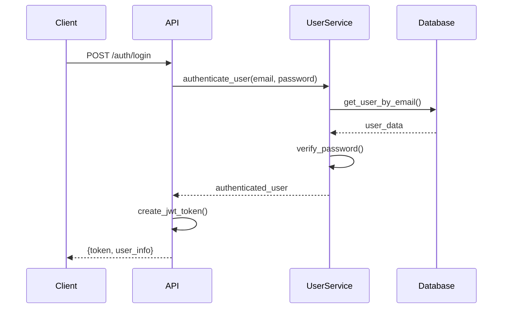

# EquityScope User Management System Architecture

## Overview

The EquityScope User Management System provides comprehensive authentication, authorization, rate limiting, and user lifecycle management for the DCF analysis platform. This document outlines the architectural design, data models, services, and integration patterns.

## System Architecture

```
┌─────────────────────────────────────────────────────────────────┐
│                        Frontend Layer                           │
├─────────────────────────────────────────────────────────────────┤
│  React Components │ Authentication │ Protected Routes │ Hooks   │
└─────────────────────────────────────────────────────────────────┘
                                │
                                ▼
┌─────────────────────────────────────────────────────────────────┐
│                         API Layer                               │
├─────────────────────────────────────────────────────────────────┤
│  FastAPI │ Auth Endpoints │ Protected Analysis │ Rate Limiting   │
└─────────────────────────────────────────────────────────────────┘
                                │
                                ▼
┌─────────────────────────────────────────────────────────────────┐
│                      Service Layer                              │
├─────────────────────────────────────────────────────────────────┤
│ UserService │ AuthService │ CacheService │ NotificationService  │
└─────────────────────────────────────────────────────────────────┘
                                │
                                ▼
┌─────────────────────────────────────────────────────────────────┐
│                       Data Layer                                │
├─────────────────────────────────────────────────────────────────┤
│  File JSON Storage │ PostgreSQL │ Redis Cache │ Session Store   │
└─────────────────────────────────────────────────────────────────┘
```

## Core Components

### 1. Authentication & Authorization

#### JWT-Based Authentication
```python
# Token Structure
{
  "sub": "user@example.com",          # Subject (user email)
  "user_id": "uuid",                  # User identifier
  "tier": "professional",             # Subscription tier
  "exp": 1647345600,                  # Expiration timestamp
  "iat": 1647342000,                  # Issued at timestamp
  "jti": "token-uuid"                 # JWT ID for blacklisting
}
```

#### API Key Authentication
```python
# API Key Format: eq_<base64_encoded_data>
# Structure: eq_userid_timestamp_random_hash
# Example: eq_a1b2c3d4_1647342000_xyz789_sha256hash
```

#### Authentication Flow


### 2. User Data Models

#### Core User Model
```python
class User(BaseModel):
    id: str = Field(default_factory=lambda: str(uuid.uuid4()))
    email: EmailStr
    full_name: Optional[str] = None
    company: Optional[str] = None
    hashed_password: str
    
    # Status & Verification
    status: UserStatus = UserStatus.PENDING_VERIFICATION
    email_verified: bool = False
    verification_token: Optional[str] = None
    
    # Subscription & Tier
    tier: UserTier = UserTier.FREE
    subscription_start: Optional[datetime] = None
    subscription_end: Optional[datetime] = None
    
    # Usage Tracking
    total_analyses: int = 0
    monthly_analyses: int = 0
    
    # Rate Limiting
    rate_limit_count: int = 0
    rate_limit_window_start: Optional[datetime] = None
    
    # Security
    reset_token: Optional[str] = None
    reset_token_expires: Optional[datetime] = None
    
    # Timestamps
    created_at: datetime = Field(default_factory=datetime.utcnow)
    updated_at: datetime = Field(default_factory=datetime.utcnow)
    last_login: Optional[datetime] = None
    last_analysis: Optional[datetime] = None
    
    # Preferences
    preferences: Dict[str, Any] = Field(default_factory=dict)
```

#### Subscription Tiers
```python
class UserTier(str, Enum):
    FREE = "free"
    PROFESSIONAL = "professional"
    ENTERPRISE = "enterprise"

# Rate Limits by Tier
TIER_LIMITS = {
    UserTier.FREE: {
        "analyses_per_hour": 5,
        "analyses_per_day": 20,
        "analyses_per_month": 100,
        "api_keys": 1,
        "concurrent_sessions": 2
    },
    UserTier.PROFESSIONAL: {
        "analyses_per_hour": 50,
        "analyses_per_day": 200,
        "analyses_per_month": 2000,
        "api_keys": 5,
        "concurrent_sessions": 5
    },
    UserTier.ENTERPRISE: {
        "analyses_per_hour": 500,
        "analyses_per_day": 2000,
        "analyses_per_month": 20000,
        "api_keys": 20,
        "concurrent_sessions": 20
    }
}
```

### 3. Database Architecture

#### Multi-Database Support
```python
class DatabaseConfig:
    def __init__(self):
        db_type = settings.DATABASE_TYPE
        
        if db_type == "file_json":
            self.adapter = FileJSONAdapter()
        elif db_type == "sqlite":
            self.adapter = SQLiteAdapter()
        elif db_type == "postgresql":
            self.adapter = PostgreSQLAdapter()
        else:
            raise ValueError(f"Unsupported database type: {db_type}")
```

#### File-Based Storage Structure
```
/data/
├── users.json              # User records
├── api_keys.json          # API key records  
├── sessions.json          # Active sessions
├── usage_stats.json       # Usage statistics
└── system_stats.json      # System-wide metrics
```

#### PostgreSQL Schema
```sql
-- Users table
CREATE TABLE users (
    id UUID PRIMARY KEY DEFAULT uuid_generate_v4(),
    email VARCHAR(255) UNIQUE NOT NULL,
    full_name VARCHAR(255),
    company VARCHAR(255),
    hashed_password TEXT NOT NULL,
    status VARCHAR(50) DEFAULT 'pending_verification',
    email_verified BOOLEAN DEFAULT FALSE,
    tier VARCHAR(50) DEFAULT 'free',
    subscription_start TIMESTAMP,
    subscription_end TIMESTAMP,
    total_analyses INTEGER DEFAULT 0,
    monthly_analyses INTEGER DEFAULT 0,
    rate_limit_count INTEGER DEFAULT 0,
    rate_limit_window_start TIMESTAMP,
    verification_token TEXT,
    reset_token TEXT,
    reset_token_expires TIMESTAMP,
    created_at TIMESTAMP DEFAULT CURRENT_TIMESTAMP,
    updated_at TIMESTAMP DEFAULT CURRENT_TIMESTAMP,
    last_login TIMESTAMP,
    last_analysis TIMESTAMP,
    preferences JSONB DEFAULT '{}'
);

-- API Keys table
CREATE TABLE api_keys (
    id UUID PRIMARY KEY DEFAULT uuid_generate_v4(),
    user_id UUID REFERENCES users(id) ON DELETE CASCADE,
    name VARCHAR(255) NOT NULL,
    key_hash TEXT NOT NULL,
    is_active BOOLEAN DEFAULT TRUE,
    expires_at TIMESTAMP,
    last_used TIMESTAMP,
    created_at TIMESTAMP DEFAULT CURRENT_TIMESTAMP
);

-- Sessions table
CREATE TABLE sessions (
    session_id UUID PRIMARY KEY DEFAULT uuid_generate_v4(),
    user_id UUID REFERENCES users(id) ON DELETE CASCADE,
    ip_address INET,
    user_agent TEXT,
    is_active BOOLEAN DEFAULT TRUE,
    created_at TIMESTAMP DEFAULT CURRENT_TIMESTAMP,
    last_activity TIMESTAMP DEFAULT CURRENT_TIMESTAMP
);

-- Indexes for performance
CREATE INDEX idx_users_email ON users(email);
CREATE INDEX idx_users_tier ON users(tier);
CREATE INDEX idx_api_keys_hash ON api_keys(key_hash);
CREATE INDEX idx_sessions_user_id ON sessions(user_id);
```

### 4. Service Layer Architecture

#### UserService
```python
class UserService:
    """
    Core user management service handling CRUD operations,
    authentication, and business logic.
    """
    
    def __init__(self):
        self.db = DatabaseConfig().adapter
        self.cache = CacheService()
        
    # Core CRUD Operations
    async def create_user(self, user_create: UserCreate) -> User
    async def get_user_by_id(self, user_id: str) -> Optional[User]
    async def get_user_by_email(self, email: str) -> Optional[User]
    async def update_user(self, user: User) -> User
    async def delete_user(self, user_id: str) -> bool
    
    # Authentication
    async def authenticate_user(self, email: str, password: str) -> Optional[User]
    async def validate_api_key(self, api_key: str) -> Optional[User]
    
    # Rate Limiting
    async def check_rate_limit(self, user_id: str) -> Dict[str, Any]
    async def record_analysis(self, user_id: str) -> bool
    
    # Session Management
    async def create_session(self, user_id: str, ip: str, user_agent: str) -> SessionData
    async def get_active_sessions(self, user_id: str) -> List[SessionData]
    async def invalidate_session(self, session_id: str) -> bool
    
    # API Key Management
    async def create_api_key(self, user_id: str, name: str, expires_days: int) -> Tuple[APIKey, str]
    async def revoke_api_key(self, api_key_id: str) -> bool
    
    # Statistics & Analytics
    async def get_usage_stats(self, user_id: str) -> UsageStats
    async def get_system_stats(self) -> Dict[str, Any]
```

#### Rate Limiting Service
```python
class RateLimitService:
    """
    Advanced rate limiting with multiple time windows and strategies.
    """
    
    def __init__(self):
        self.redis = redis.Redis.from_url(settings.REDIS_URL)
        
    async def check_rate_limit(self, user_id: str, tier: UserTier) -> RateLimitStatus:
        """
        Check rate limits across multiple time windows:
        - Hourly: Short-term burst protection
        - Daily: Prevent sustained abuse
        - Monthly: Subscription enforcement
        """
        limits = TIER_LIMITS[tier]
        now = datetime.utcnow()
        
        # Check hourly limit
        hourly_key = f"rate_limit:hourly:{user_id}:{now.hour}"
        hourly_count = await self.redis.get(hourly_key) or 0
        
        # Check daily limit  
        daily_key = f"rate_limit:daily:{user_id}:{now.date()}"
        daily_count = await self.redis.get(daily_key) or 0
        
        # Check monthly limit
        monthly_key = f"rate_limit:monthly:{user_id}:{now.year}-{now.month}"
        monthly_count = await self.redis.get(monthly_key) or 0
        
        is_limited = (
            int(hourly_count) >= limits["analyses_per_hour"] or
            int(daily_count) >= limits["analyses_per_day"] or  
            int(monthly_count) >= limits["analyses_per_month"]
        )
        
        return RateLimitStatus(
            is_rate_limited=is_limited,
            hourly_usage=int(hourly_count),
            daily_usage=int(daily_count),
            monthly_usage=int(monthly_count),
            limits=limits
        )
```

### 5. Security Architecture

#### Password Security
```python
class PasswordSecurity:
    """
    Secure password handling with bcrypt and policy enforcement.
    """
    
    @staticmethod
    def hash_password(password: str) -> str:
        """Hash password using bcrypt with salt"""
        salt = bcrypt.gensalt()
        return bcrypt.hashpw(password.encode('utf-8'), salt).decode('utf-8')
    
    @staticmethod
    def verify_password(password: str, hashed: str) -> bool:
        """Verify password against hash"""
        return bcrypt.checkpw(password.encode('utf-8'), hashed.encode('utf-8'))
    
    @staticmethod
    def validate_password_strength(password: str) -> bool:
        """
        Enforce password policy:
        - Minimum 8 characters
        - At least one uppercase letter
        - At least one lowercase letter  
        - At least one digit
        """
        if len(password) < 8:
            return False
        if not re.search(r'[A-Z]', password):
            return False
        if not re.search(r'[a-z]', password):
            return False
        if not re.search(r'\d', password):
            return False
        return True
```

#### Token Security
```python
class TokenSecurity:
    """
    JWT token creation and validation with security best practices.
    """
    
    @staticmethod
    def create_access_token(user: User, expires_delta: Optional[timedelta] = None) -> str:
        """Create JWT access token"""
        if expires_delta:
            expire = datetime.utcnow() + expires_delta
        else:
            expire = datetime.utcnow() + timedelta(minutes=settings.ACCESS_TOKEN_EXPIRE_MINUTES)
        
        to_encode = {
            "sub": user.email,
            "user_id": user.id,
            "tier": user.tier.value,
            "exp": expire,
            "iat": datetime.utcnow(),
            "jti": str(uuid.uuid4())  # JWT ID for token revocation
        }
        
        encoded_jwt = jwt.encode(to_encode, settings.SECRET_KEY, algorithm=settings.ALGORITHM)
        return encoded_jwt
    
    @staticmethod
    def create_api_key(user_id: str) -> Tuple[str, str]:
        """
        Create API key with secure random generation
        Format: eq_<user_id_short>_<timestamp>_<random>
        """
        timestamp = str(int(time.time()))
        random_part = secrets.token_urlsafe(16)
        user_id_short = user_id[:8]
        
        raw_key = f"eq_{user_id_short}_{timestamp}_{random_part}"
        key_hash = hashlib.sha256(raw_key.encode()).hexdigest()
        
        return raw_key, key_hash
```

### 6. Integration with DCF Analysis System

#### Protected Analysis Endpoints
```python
class ProtectedAnalysisService:
    """
    Integration layer between user management and DCF analysis.
    """
    
    def __init__(self):
        self.user_service = UserService()
        self.dcf_service = MultiModelDCFService()
        self.cache_service = CacheService()
    
    async def analyze_with_auth(self, 
                              ticker: str, 
                              user: Optional[User], 
                              user_assumptions: Optional[Dict] = None) -> Dict:
        """
        Perform DCF analysis with authentication and rate limiting
        """
        # Handle anonymous vs authenticated users
        if user:
            # Check rate limits
            rate_status = await self.user_service.check_rate_limit(user.id)
            if rate_status["is_rate_limited"]:
                raise RateLimitExceededException(rate_status)
            
            # Record usage
            await self.user_service.record_analysis(user.id)
            
            # Set user context
            user_tier = user.tier.value
            user_level = self._determine_user_level(user)
            cache_key_params = {"user_tier": user_tier, "user_id": user.id}
            
        else:
            # Anonymous user - basic rate limiting and features
            user_tier = "anonymous" 
            user_level = "beginner"
            cache_key_params = {"user_tier": user_tier}
        
        # Check cache with user-specific key
        cached_result = await self.cache_service.get_cached_analysis(
            ticker, user_assumptions, **cache_key_params
        )
        
        if cached_result:
            return self._add_user_metadata(cached_result, user, True)
        
        # Perform fresh analysis
        analysis_result = await self.dcf_service.comprehensive_analysis(
            ticker=ticker,
            user_assumptions=user_assumptions,
            user_level=user_level
        )
        
        # Cache result with user-specific context
        await self.cache_service.cache_analysis(
            ticker, analysis_result, user_assumptions, **cache_key_params
        )
        
        return self._add_user_metadata(analysis_result, user, False)
```

### 7. Caching Integration

#### User-Aware Caching
```python
class UserAwareCacheService:
    """
    Intelligent caching that considers user context and subscription tiers.
    """
    
    def __init__(self):
        self.redis = redis.Redis.from_url(settings.REDIS_URL)
        
    async def get_cache_key(self, base_key: str, user: Optional[User] = None, **params) -> str:
        """
        Generate cache key with user context
        
        Cache segmentation strategy:
        - Free users: Shared cache for basic analyses
        - Paid users: User-specific cache for custom assumptions
        - Anonymous: Most basic cache tier
        """
        key_parts = [base_key]
        
        if user:
            if user.tier in [UserTier.PROFESSIONAL, UserTier.ENTERPRISE]:
                # Paid users get personalized cache
                key_parts.append(f"user:{user.id}")
            else:
                # Free users share cache but with tier identifier
                key_parts.append(f"tier:{user.tier.value}")
        else:
            key_parts.append("anonymous")
        
        # Add parameter hash for unique variations
        if params:
            param_hash = hashlib.md5(json.dumps(params, sort_keys=True).encode()).hexdigest()[:8]
            key_parts.append(f"params:{param_hash}")
        
        return ":".join(key_parts)
    
    async def get_ttl_for_user(self, user: Optional[User] = None) -> int:
        """
        Dynamic TTL based on user tier
        - Anonymous: 1 hour (basic cache)
        - Free: 6 hours (standard cache)
        - Professional: 24 hours (extended cache)
        - Enterprise: 48 hours (premium cache)
        """
        if not user:
            return 3600  # 1 hour
        
        tier_ttl = {
            UserTier.FREE: 6 * 3600,        # 6 hours
            UserTier.PROFESSIONAL: 24 * 3600,  # 24 hours
            UserTier.ENTERPRISE: 48 * 3600     # 48 hours
        }
        
        return tier_ttl.get(user.tier, 3600)
```

### 8. Monitoring and Analytics

#### User Analytics Service
```python
class UserAnalyticsService:
    """
    Comprehensive user behavior and system analytics.
    """
    
    def __init__(self):
        self.db = DatabaseConfig().adapter
        self.redis = redis.Redis.from_url(settings.REDIS_URL)
    
    async def track_user_event(self, user_id: str, event_type: str, metadata: Dict = None):
        """Track user events for analytics"""
        event = {
            "user_id": user_id,
            "event_type": event_type,
            "metadata": metadata or {},
            "timestamp": datetime.utcnow().isoformat()
        }
        
        # Store in Redis for real-time analytics  
        await self.redis.lpush(f"events:{user_id}", json.dumps(event))
        await self.redis.expire(f"events:{user_id}", 86400 * 30)  # 30 days
    
    async def get_user_behavior_insights(self, user_id: str) -> Dict:
        """Generate behavior insights for user"""
        events = await self.redis.lrange(f"events:{user_id}", 0, -1)
        
        # Analyze patterns
        analysis_count = len([e for e in events if "analyze" in json.loads(e)["event_type"]])
        peak_hours = self._analyze_peak_usage_hours(events)
        favorite_sectors = self._analyze_sector_preferences(events)
        
        return {
            "total_events": len(events),
            "analysis_count": analysis_count,
            "peak_hours": peak_hours,
            "favorite_sectors": favorite_sectors,
            "engagement_score": self._calculate_engagement_score(events)
        }
    
    async def get_system_metrics(self) -> Dict:
        """Get system-wide metrics"""
        users = await self.db.get_all_users()
        
        metrics = {
            "total_users": len(users),
            "users_by_tier": {},
            "users_by_status": {},
            "monthly_active_users": 0,
            "total_analyses": 0,
            "cache_performance": await self._get_cache_metrics()
        }
        
        for user in users:
            # Count by tier
            tier = user.tier.value
            metrics["users_by_tier"][tier] = metrics["users_by_tier"].get(tier, 0) + 1
            
            # Count by status
            status = user.status.value
            metrics["users_by_status"][status] = metrics["users_by_status"].get(status, 0) + 1
            
            # Monthly active users (analyzed in last 30 days)
            if user.last_analysis and (datetime.utcnow() - user.last_analysis).days <= 30:
                metrics["monthly_active_users"] += 1
            
            # Total analyses
            metrics["total_analyses"] += user.total_analyses
        
        return metrics
```

### 9. Error Handling and Resilience

#### Exception Hierarchy
```python
class UserManagementException(Exception):
    """Base exception for user management errors"""
    pass

class AuthenticationException(UserManagementException):
    """Authentication failed"""
    pass

class AuthorizationException(UserManagementException):
    """Insufficient permissions"""
    pass

class RateLimitExceededException(UserManagementException):
    """Rate limit exceeded"""
    def __init__(self, rate_limit_status: Dict):
        self.rate_limit_status = rate_limit_status
        super().__init__(f"Rate limit exceeded: {rate_limit_status}")

class ValidationException(UserManagementException):
    """Data validation failed"""
    pass

class ResourceNotFoundException(UserManagementException):
    """Requested resource not found"""
    pass
```

#### Circuit Breaker Pattern
```python
class DatabaseCircuitBreaker:
    """
    Circuit breaker for database operations to handle failures gracefully
    """
    
    def __init__(self, failure_threshold: int = 5, timeout: int = 60):
        self.failure_threshold = failure_threshold
        self.timeout = timeout
        self.failure_count = 0
        self.last_failure_time = None
        self.state = "closed"  # closed, open, half-open
    
    async def call(self, func, *args, **kwargs):
        """Execute function with circuit breaker protection"""
        if self.state == "open":
            if time.time() - self.last_failure_time < self.timeout:
                raise Exception("Circuit breaker is open")
            else:
                self.state = "half-open"
        
        try:
            result = await func(*args, **kwargs)
            if self.state == "half-open":
                self.state = "closed"
                self.failure_count = 0
            return result
        except Exception as e:
            self.failure_count += 1
            self.last_failure_time = time.time()
            
            if self.failure_count >= self.failure_threshold:
                self.state = "open"
            
            raise e
```

### 10. Testing Strategy

#### Comprehensive Test Coverage
```python
# Unit Tests
class TestUserModel:
    """Test User model functionality"""
    - test_user_creation()
    - test_password_hashing()
    - test_rate_limits_by_tier()
    - test_subscription_status()
    - test_jwt_token_creation()

class TestUserService:
    """Test UserService functionality"""  
    - test_create_user()
    - test_authenticate_user()
    - test_rate_limiting()
    - test_api_key_creation()
    - test_session_management()

# Integration Tests
class TestAuthenticationFlow:
    """Test end-to-end authentication flow"""
    - test_registration_to_verification()
    - test_login_with_rate_limiting()  
    - test_api_key_authentication()
    - test_password_reset_flow()

# Load Tests
class TestRateLimiting:
    """Test rate limiting under load"""
    - test_concurrent_requests()
    - test_burst_protection()
    - test_tier_based_limits()
```

## Deployment Considerations

### 1. Scalability
- Horizontal scaling with load balancers
- Database connection pooling
- Redis clustering for cache layer
- CDN for static assets

### 2. Security
- HTTPS everywhere with HSTS
- JWT token rotation and blacklisting
- API key rotation policies  
- Rate limiting at multiple levels
- SQL injection prevention
- XSS and CSRF protection

### 3. Monitoring
- Real-time user activity monitoring
- Performance metrics and alerting
- Security event logging
- Business intelligence dashboards

### 4. Backup and Recovery
- Automated database backups
- Point-in-time recovery
- Disaster recovery procedures
- Data retention policies

This architecture provides a robust, scalable foundation for user management that integrates seamlessly with the EquityScope DCF analysis platform while maintaining security, performance, and user experience standards.